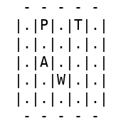
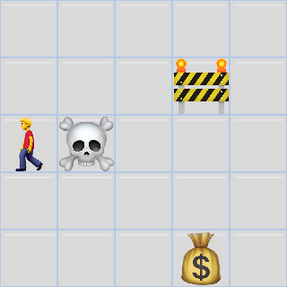

# TreasureRoom-RL
Simple environment where a Reinforcement Learning agent has to find a treasure in a room with different obstacles.

## Rules of the game
Our agent lies in a room discretized in $N×N$ cells.
The agent can move from one cell to an adjacent one using one of the following actions: 
- MOVE UP
- MOVE LEFT
- MOVE RIGHT
- MOVE DOWN
  

The room contains three type of special cells:
1. A wardrobe that the agent cannot pass through
2. A cell with a treasure that represents the goal of the game
3. A cell with poison
   
And all of the other cells are empty, allowing regular movement of the agent inside the room.

The agent may start at any position except for the wardrobe cell. If the agent reaches either the treasure or the poison block, the game is over.

The agent receives a reward of +10 if it reaches the treasure block, a reward of −10 if it reaches the poison block and −1 point for the other blocks.
